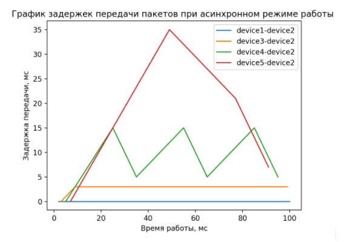
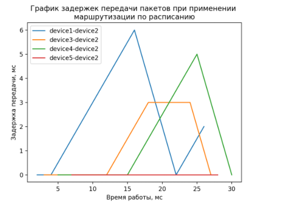

# data-transmission-protocol
## This is a simulation of asynchronous and synchronous data transmission protocols.
I wrote this as an 11th semester's course project. This is still far from perfect and i will improve it for my thesis project.

## The protocol i developed has 2 modes: anync and synced to a schedule.

### Async mode
In this mode all devices in the network make attempts to send data to their destination. If such send request is approved device transmitts data to the next network node, otherwise data stays in device and its delay grows.

In conclusion it leads to a **delays that look like this**:

### Synced mode (Schedule)

This mode is designed in a way to solve the problem with the **unexpected huge delays**. This time router has a schedule that regulates all ongoing transactions.

**It looks like this**:

| Transaction   | Start time | End time | Device sender | Device receiver |  
 ---            | ---        | ---      | ---           |---              |
| 1             | 0          | 2        | device1       | device2         |
| 2             | 3          | 7        | device3       | device2         |
| 3             | 9          | 12       | device7       | device1         |
| ...           | ...        | ...      | ...           | ...             |

This helps to make delays **much smaller and fully predictable**:

